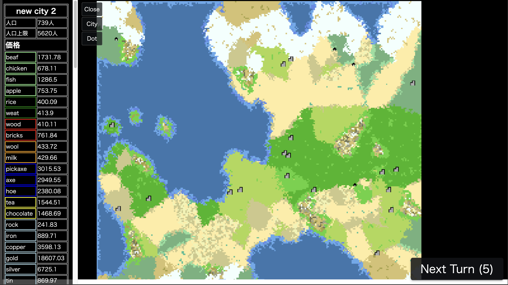

# アプリ概要


Pixi.jsを使った地政学シミュレーションを作りたい。

- 内政重視で
- 一応戦争できる？
- 交通網や市場といった要素をしっかり作りたい。
- OpenFront.ioのオマージュ

# 現状

- マップを乱数を使ったランダムな生成が可能。（乱数シードを決めることで同じマップにアクセス可能）
- ドット毎の情報を持たせることに成功
  - ドット毎の情報はbyte型の256までの数字でbiomeIDと名付けている。
- 都市要素
- 資源の生産消費要素

## 課題
- `pnpm run build`　が通らない -> `npx prettier --write .`の実行で９割のエラー解消できるのでデプロイ時にはこれを実行

# 環境構築

```sh
npm i
npm run dev
```

or

```sh
pnpm i
pnpm run dev
```

## app

- render10
- gamedata
  - chunk
  - cities
  - lines
- maptag
  - sprite
- viewport

全てmain.tsの`const game = new MainApp()`の`game`で管理可能
